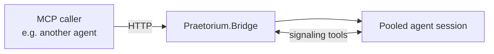

# Praetorium.Bridge

> **Turn an AI agent into a callable MCP tool — and let two agents have a real conversation through it.**

Praetorium.Bridge is a .NET 10 server that publishes AI-agent-backed tools over the [Model Context Protocol](https://modelcontextprotocol.io). You describe each tool in JSON — its inputs, its agent, its prompt — and the bridge spawns the agent, keeps its session alive across calls, and surfaces the whole thing in a live dashboard.

What sets it apart from a one-shot LLM call wrapped behind an MCP endpoint:

- **Real-time agent-to-agent dialogue.** A signaling tool inside the agent's session can park the caller, hand control back to the agent for follow-up, and resume — so an agent calling the bridge can ask clarifying questions, request more context, and respond, all in one logical exchange instead of a stateless request/response.
- **Sessions that survive across calls.** A code-review tool, for instance, holds the same agent through every clarification round of the same review (`per-reference` mode) — the model keeps its context, you don't pay to re-prime it, and the conversation actually progresses instead of restarting.

The goal is to make it boring to expose an agent as a tool: no glue code, no per-tool wiring, no redeploys.

> **Status:** `0.1.0` — prerelease. Interfaces, schema, and UI are still moving.

---

## How it works



A caller invokes a tool over HTTP. The bridge routes it to the right agent session — spawning a new one or reusing a pooled one based on the tool's session mode — and the agent runs until it hits a *signaling tool*. Non-blocking signaling tools stream a payload back and let the agent keep going; blocking ones park the agent's turn until the caller replies on the same MCP call, enabling a true back-and-forth without losing session state.

Everything that varies between tools — the agent backend, the prompt, the parameter schema, the session lifetime, the signaling contract — lives in `praetorium-bridge.json` and hot-reloads.

---

## Quick start

```bash
dotnet run --project src/Praetorium.Bridge.Web
```

`dotnet run` will print the bound URL (the launch profile defaults to <http://localhost:5067>); the dashboard is served at `/`, the MCP endpoint at `/mcp`. Override with `ASPNETCORE_URLS` or by editing `Properties/launchSettings.json`.

On first launch the bridge reads `praetorium-bridge.json` from:

| OS | Path |
|---|---|
| Windows | `%APPDATA%\PraetoriumBridge\` |
| Linux / macOS | `~/.config/PraetoriumBridge/` |

A working starter config lives in [`examples/PraetoriumBridge/`](examples/) — copy it into the path above, then point any MCP client (Claude Desktop, Copilot, another bridge) at the endpoint.

**Prerequisites:** .NET 10 SDK, and access to a GitHub Copilot–compatible endpoint for the bundled provider.

---

## What's in the box

- **`Praetorium.Bridge`** — the core library: session lifecycle, signaling, tool dispatch, hot-reload
- **`Praetorium.Bridge.CopilotProvider`** — agent provider backed by the GitHub Copilot SDK
- **`Praetorium.Bridge.Web`** — Blazor dashboard with a configuration editor, prompt editor, live session view, and a Config Agent that edits the JSON for you

The core library is built around replaceable abstractions (`IAgentProvider`, `IAgentSession`, `ISessionStore`, `ISignalRegistry`, `IConfigurationProvider`, `IBridgeHooks`) so you can swap in a different LLM backend, persistent session store, or alternate config source.

The schema for `praetorium-bridge.json` is in [`praetorium-bridge.schema.json`](praetorium-bridge.schema.json) (drop it into your editor's JSON schema settings for autocomplete). The full design — session modes, signaling contracts, prompt templating, the lot — is in [`praetorium-bridge-design.md`](praetorium-bridge-design.md).

---

## Roadmap

For `0.2+`:

- More `IAgentProvider` implementations (Anthropic, OpenAI, Azure OpenAI, local models)
- Dashboard authentication

Contributions, bug reports, and design feedback are welcome.

---

## License

See [`LICENSE.txt`](LICENSE.txt).
