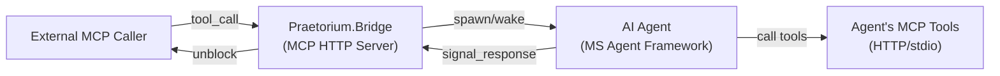
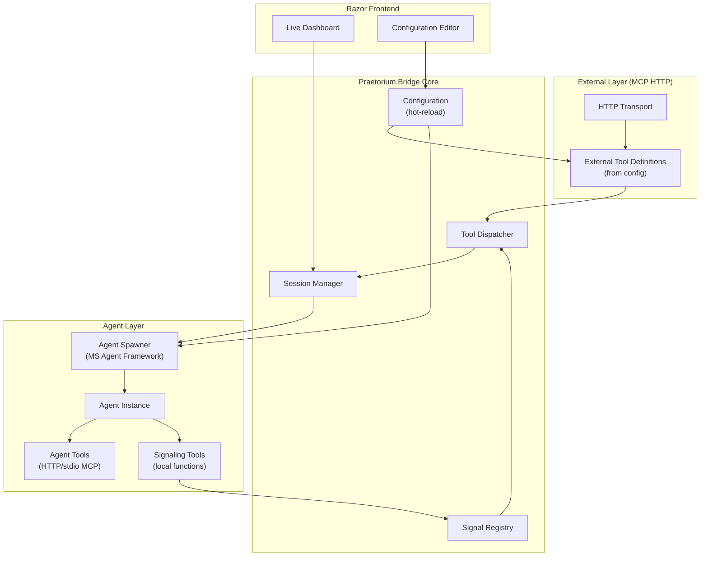
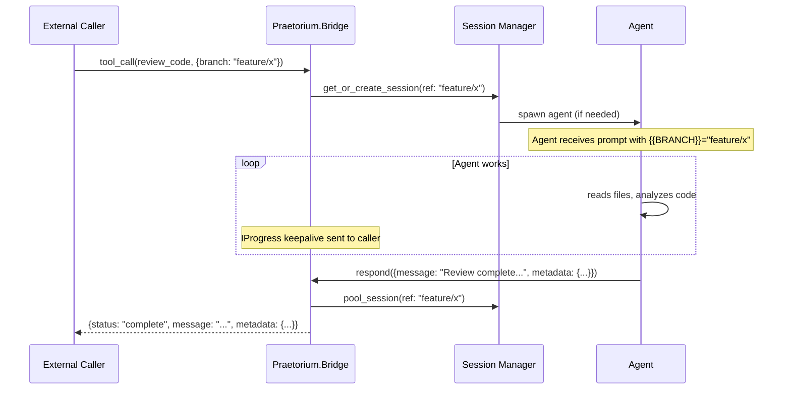
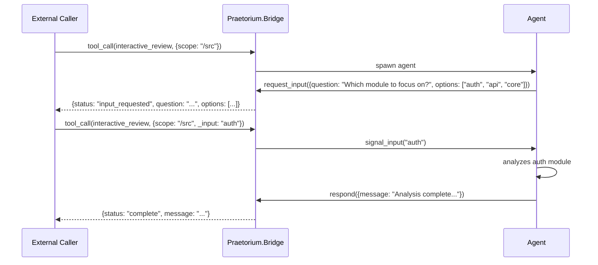
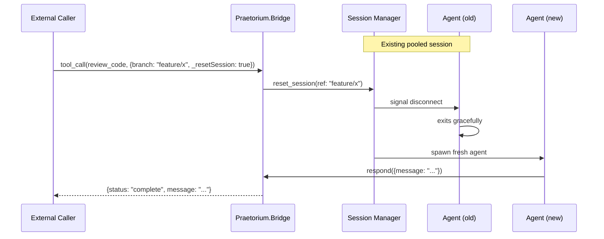
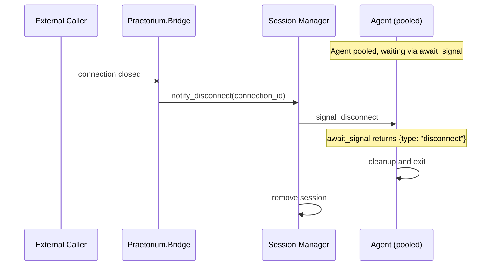
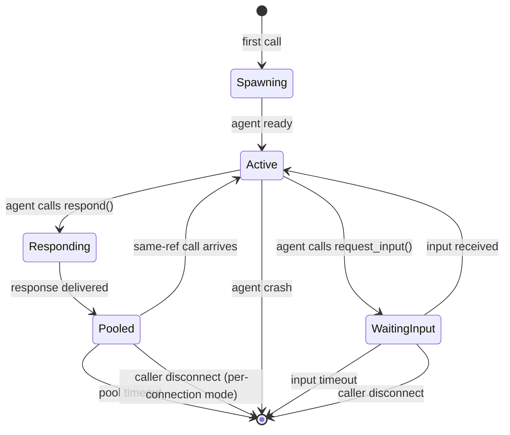
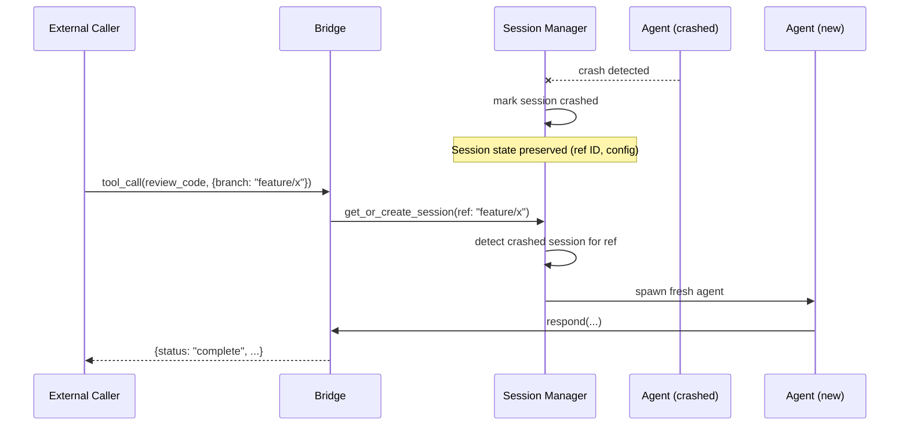

# Praetorium.Bridge — Design Document

> A configurable MCP-to-Agent bridge that exposes custom tools to external callers and routes them to AI agents with full signaling control.

---

## Elevator Pitch

**Turn any AI agent into a callable MCP tool with configurable signaling, session management, and prompt templates.**

Define tools in JSON — no code changes. External callers invoke your tools via MCP HTTP; behind each tool, an AI agent processes the request and signals back. Session pooling, crash recovery, hot-reload configuration, and a live monitoring dashboard included.

---

## Why This Exists

Building MCP tools that delegate to AI agents requires solving the same problems every time:

1. **Session management** — spawn agents, pool them, handle crashes
2. **Signaling** — block the caller until the agent responds, handle timeouts
3. **Configuration** — change prompts/tools without redeploying
4. **Monitoring** — see what's running, debug stuck sessions

Praetorium.Bridge handles all of this. You define tools in JSON; the bridge does the rest.



---

## Core Concepts

### External Tools vs Agent Tools

| Layer | What it is | Who calls it |
|-------|-----------|--------------|
| **External Tools** | MCP tools exposed via HTTP to outside callers | External systems, other agents, CLI |
| **Agent Tools** | MCP tools available to the internal AI agent | The spawned AI agent |
| **Signaling Tools** | Special local-function tools for agent↔bridge communication | The spawned AI agent (automatically injected) |

External tools are defined in configuration. Each external tool maps to an agent configuration (model, prompts, reasoning level) and optionally to a set of agent tools (HTTP or stdio MCP servers).

### Sessions

A **session** is a stateful agent instance tied to either:

1. **Reference ID** — caller provides an ID; same ID = same session (pooling)
2. **MCP Connection** — one session per transport connection (default when no reference ID)
3. **Global** — single session shared by all callers (configurable)

Sessions can be reset explicitly via a tool parameter.

---

## Architecture



---

## Configuration

All configuration lives in `praetorium-bridge.json`. Changes are hot-reloaded — no restart required for tool definitions, prompts, or agent settings.

### Root Structure

```json
{
  "server": {
    "port": 5100,
    "basePath": "/mcp",
    "bindAddress": "localhost"
  },
  "defaults": {
    "agent": {
      "provider": "github-copilot",
      "model": "claude-sonnet-4",
      "reasoningEffort": "medium"
    },
    "session": {
      "mode": "per-connection",
      "poolTimeoutMinutes": 30,
      "responseTimeoutMinutes": 10,
      "responseTimeoutSeconds": 600
    },
    "signaling": {
      "keepaliveIntervalSeconds": 15
    }
  },
  "tools": { },
  "agentToolSources": { }
}
```

### Tool Definitions

Each external tool is defined under `tools`:

```json
{
  "tools": {
    "review_code": {
      "description": "Request an AI code review for the specified changes",
      "parameters": {
        "branch": {
          "type": "string",
          "description": "Branch to review against base",
          "required": false
        },
        "focusAreas": {
          "type": "array",
          "items": { "type": "string" },
          "description": "Specific areas to focus the review on",
          "required": false
        }
      },
      "fixedParameters": {
        "reviewType": "code"
      },
      "agent": {
        "promptFile": "./prompts/code-review.md",
        "tools": ["filesystem", "git"],
        "model": "claude-sonnet-4",
        "reasoningEffort": "high"
      },
      "session": {
        "mode": "per-reference",
        "referenceIdParameter": "branch"
      },
      "signaling": {
        "tools": ["respond"]
      }
    },
    "analyze_architecture": {
      "description": "Analyze codebase architecture and provide recommendations",
      "parameters": {
        "scope": {
          "type": "string",
          "description": "Directory or namespace to analyze",
          "required": true
        }
      },
      "agent": {
        "promptFile": "./prompts/architecture-analysis.md",
        "tools": ["filesystem", "code-search"],
        "reasoningEffort": "high"
      },
      "signaling": {
        "tools": ["respond", "request_input"]
      }
    }
  }
}
```

### Parameter Schema

Parameters support standard JSON Schema types:

| Type | JSON Schema | Notes |
|------|-------------|-------|
| `string` | `{ "type": "string" }` | Basic text |
| `number` | `{ "type": "number" }` | Floating point |
| `integer` | `{ "type": "integer" }` | Whole numbers |
| `boolean` | `{ "type": "boolean" }` | True/false |
| `array` | `{ "type": "array", "items": {...} }` | List of items |
| `object` | `{ "type": "object", "properties": {...} }` | Nested object |

### Reserved Parameters

These parameters are automatically available on every external tool (do not define them in config):

| Parameter | Type | Description |
|-----------|------|-------------|
| `_resetSession` | `boolean` | Force a fresh agent session. In `per-connection` mode, resets only the session bound to the current MCP connection. |

### Agent Tool Sources

Define reusable MCP tool sources that agents can connect to:

```json
{
  "agentToolSources": {
    "filesystem": {
      "type": "stdio",
      "command": "npx",
      "args": ["-y", "@anthropic/mcp-filesystem", "/workspace"]
    },
    "git": {
      "type": "stdio", 
      "command": "npx",
      "args": ["-y", "@anthropic/mcp-git"]
    },
    "code-search": {
      "type": "http",
      "url": "http://localhost:5200/mcp",
      "headers": {
        "Authorization": "Bearer {{ENV:CODE_SEARCH_TOKEN}}"
      }
    },
    "external-api": {
      "type": "http",
      "url": "https://api.example.com/mcp"
    }
  }
}
```

### Prompt Templates

Each tool defines its prompt inline via `agent.promptFile` pointing to a markdown file relative to the config. There is no separate reusable template registry — each tool owns its prompt directly.

### Placeholder Syntax

Prompts use `{{PLACEHOLDER}}` syntax:

```markdown
# Code Review Request

You are reviewing changes on branch `{{BRANCH}}` against the base branch.

{{#if FOCUS_AREAS}}
## Focus Areas
Pay special attention to:
{{FOCUS_AREAS}}
{{/if}}

Review type: {{REVIEW_TYPE}}
```

Supported constructs:

| Syntax | Description |
|--------|-------------|
| `{{NAME}}` | Simple substitution (removed if empty) |
| `{{#if NAME}}...{{/if}}` | Conditional block (removed if placeholder empty) |
| `{{#each NAME}}...{{/each}}` | Iterate array (use `{{.}}` for current item) |
| `{{ENV:VAR_NAME}}` | Environment variable substitution |

---

## Signaling

Signaling tools are local functions injected into every agent session. They enable the agent to communicate with the bridge without making external HTTP/stdio calls.

### Available Signaling Tools

Configured per external tool via `signaling.tools`:

#### `respond`

Send a response back to the external caller and unblock their MCP call.

```json
{
  "name": "respond",
  "description": "Send the final response to the caller",
  "parameters": {
    "message": {
      "type": "string",
      "description": "The response content",
      "required": true
    },
    "metadata": {
      "type": "object",
      "description": "Optional structured data to include",
      "required": false
    }
  }
}
```

**Behavior:**
1. Packages `message` and `metadata` into the response
2. Signals the dispatcher to unblock the external caller
3. Agent session enters pooled state (waiting for next call or timeout)

#### `request_input`

Send an intermediate response and wait for additional input from the caller.

```json
{
  "name": "request_input",
  "description": "Request additional information from the caller",
  "parameters": {
    "question": {
      "type": "string", 
      "description": "What information is needed",
      "required": true
    },
    "options": {
      "type": "array",
      "items": { "type": "string" },
      "description": "Suggested options (if applicable)",
      "required": false
    }
  }
}
```

**Behavior:**
1. Sends `question` and `options` to the external caller as an intermediate response
2. External caller's MCP call returns with `status: "input_requested"`
3. Agent blocks waiting for input
4. When caller invokes the tool again with `_input` parameter, agent unblocks with that input
5. If caller disconnects or times out, agent unblocks with `null` (should handle gracefully)

#### `await_signal`

Block until an external event occurs (caller provides input, disconnects, or requests reset).

```json
{
  "name": "await_signal",
  "description": "Wait for the next signal from the external caller",
  "parameters": { }
}
```

**Behavior:**
1. Agent blocks
2. Returns one of:
   - `{ "type": "input", "data": {...} }` — caller sent input
   - `{ "type": "disconnect" }` — caller disconnected
   - `{ "type": "reset" }` — caller requested new session
   - `{ "type": "timeout" }` — pool timeout reached

This is the primitive that `request_input` is built on. Use it for custom multi-turn flows.

### Signaling Tool Configuration

Each external tool declares which signaling tools the agent can use:

```json
{
  "tools": {
    "simple_query": {
      "signaling": {
        "tools": ["respond"]
      }
    },
    "interactive_review": {
      "signaling": {
        "tools": ["respond", "request_input"]
      }
    },
    "custom_flow": {
      "signaling": {
        "tools": ["respond", "await_signal"],
        "customTools": [
          {
            "name": "send_progress",
            "description": "Send a progress update without completing",
            "parameters": {
              "percent": { "type": "integer", "required": true },
              "message": { "type": "string", "required": false }
            }
          }
        ]
      }
    }
  }
}
```

Custom signaling tools follow the same pattern — they're local functions, not external MCP calls.

---

## Call Flow

### Simple Request-Response



### Multi-Turn with Input Request



### Session Reset



### Caller Disconnect



---

## Session Management

### Session Modes

| Mode | Reference ID Source | Behavior |
|------|---------------------|----------|
| `per-reference` | `referenceIdParameter` or `_referenceId` | Same ref = same session |
| `per-connection` | MCP transport connection ID | One session per connection |
| `global` | None (single session) | All callers share one session |

### Session Lifecycle



### Crash Recovery

When an agent crashes:

1. **Session Manager detects** — via Agent Framework health monitoring
2. **Session marked as crashed** — not immediately removed
3. **Next call to same session** — spawns fresh agent automatically
4. **Hooks fire** — `OnAgentCrashed` for logging/alerting



### Orphan Detection

Background scanner runs periodically to detect stuck sessions:

| Scenario | Detection | Action |
|----------|-----------|--------|
| Agent pooled but caller gone | Pool timeout | Clean up session |
| Agent waiting for input but caller gone | Input timeout | Signal disconnect to agent |
| Agent active but no response | Response timeout | Cancel and clean up |

---

## Agent Configuration

### Provider Configuration

```json
{
  "defaults": {
    "agent": {
      "provider": "github-copilot",
      "model": "claude-sonnet-4",
      "reasoningEffort": "medium"
    }
  }
}
```

#### Supported Providers

| Provider | Config Key | Notes |
|----------|------------|-------|
| GitHub Copilot | `github-copilot` | Default. Uses Copilot SDK. |
| Custom | `custom` | Implement `IAgentProvider` |

#### Reasoning Effort

| Level | Description | Provider Support |
|-------|-------------|-----------------|
| `low` | Minimal reasoning, fast responses | All |
| `medium` | Balanced (default) | All |
| `high` | Extended reasoning, slower | Check provider |

Not all models support reasoning effort. The bridge checks `IAgentProvider.SupportsReasoningEffort(model)` and ignores the setting if unsupported (logged as warning).

### Per-Tool Agent Overrides

```json
{
  "tools": {
    "complex_analysis": {
      "agent": {
        "model": "o3",
        "reasoningEffort": "high",
        "tools": ["filesystem", "git", "code-search"]
      }
    }
  }
}
```

### Tool Injection

Agent tools are injected from `agentToolSources`:

```json
{
  "agentToolSources": {
    "filesystem": {
      "type": "stdio",
      "command": "npx",
      "args": ["-y", "@anthropic/mcp-filesystem", "{{WORKSPACE_PATH}}"]
    }
  },
  "tools": {
    "review_code": {
      "agent": {
        "tools": ["filesystem"]
      }
    }
  }
}
```

The agent sees all tools from the specified sources plus the configured signaling tools.

---

## Razor Frontend

### Dashboard

Live view of active sessions and recent activity:

```
┌─────────────────────────────────────────────────────────────────┐
│ Praetorium.Bridge Dashboard                              [⚙️]   │
├─────────────────────────────────────────────────────────────────┤
│ Active Sessions: 3    │  Pooled: 7    │  Calls/min: 12         │
├─────────────────────────────────────────────────────────────────┤
│ ACTIVE SESSIONS                                                 │
│ ┌─────────────────────────────────────────────────────────────┐ │
│ │ 🟢 review_code [feature/auth-refactor]                      │ │
│ │    Duration: 45s │ Model: claude-sonnet-4 │ Tools called: 8 │ │
│ │    Last activity: reading src/auth/handler.cs               │ │
│ ├─────────────────────────────────────────────────────────────┤ │
│ │ 🟡 analyze_architecture [/src/api]                          │ │
│ │    Duration: 2m │ Waiting for input                         │ │
│ │    Question: "Focus on performance or security?"            │ │
│ ├─────────────────────────────────────────────────────────────┤ │
│ │ 🟢 custom_flow [conn:a]                                     │ │
│ │    Duration: 12s │ Tokens: 1.2k in / 850 out                │ │
│ └─────────────────────────────────────────────────────────────┘ │
├─────────────────────────────────────────────────────────────────┤
│ POOLED SESSIONS (7)                            [Expand ▼]       │
│ Click any session to open Agent View (formatted activity log)   │
├─────────────────────────────────────────────────────────────────┤
│ RECENT ACTIVITY                                                 │
│ 14:32:01  review_code[main] → completed (approved)             │
│ 14:31:45  analyze_arch[/lib] → completed                        │
│ 14:30:12  review_code[fix/123] → session reset                  │
│ 14:29:58  custom_flow[conn:b] → caller disconnected            │
└─────────────────────────────────────────────────────────────────┘
```

### Configuration Editor

Edit tools, prompts, and settings with immediate hot-reload:

```
┌─────────────────────────────────────────────────────────────────┐
│ Configuration                                            [💾]   │
├──────────────┬──────────────────────────────────────────────────┤
│ Navigation   │ Tool: review_code                                │
│              │ ────────────────────────────────────────────────  │
│ ▼ Tools      │ Description:                                     │
│   review_co… │ [Request an AI code review for specified chang] │
│   analyze_a… │                                                   │
│   custom_fl… │ Parameters:                                       │
│              │ ┌────────────────────────────────────────────┐   │
│ ▼ Agent      │ │ + branch (string, optional)                │   │
│   Sources    │ │ + focusAreas (string[], optional)          │   │
│   filesystem │ │ [+ Add Parameter]                          │   │
│   git        │ └────────────────────────────────────────────┘   │
│   code-sear… │                                                   │
│              │ Fixed Parameters:                                 │
│ ▼ Prompts    │ ┌────────────────────────────────────────────┐   │
│              │ │ reviewType: "code"                         │   │
│              │ │ [+ Add Fixed Parameter]                    │   │
│              │ └────────────────────────────────────────────┘   │
│ ▼ Defaults   │                                                   │
│              │ Agent Configuration:                              │
│              │ Model: [claude-sonnet-4 ▼]                       │
│              │ Reasoning: [high ▼]                              │
│              │ Tools: [filesystem ✓] [git ✓] [code-search ☐]   │
│              │                                                   │
│              │ Prompt File: [./prompts/code-review.md] [Edit 📝] │
└──────────────┴──────────────────────────────────────────────────┘
```

### Prompt Editor

Edit prompt templates with live placeholder preview:

```
┌─────────────────────────────────────────────────────────────────┐
│ Prompt: code-review.md                           [💾] [Preview] │
├─────────────────────────────────────────────────────────────────┤
│ # Code Review                                                   │
│                                                                 │
│ Review the changes on branch `{{BRANCH}}`.                      │
│                                                                 │
│ {{#if FOCUS_AREAS}}                                             │
│ ## Focus Areas                                                  │
│ {{#each FOCUS_AREAS}}                                           │
│ - {{.}}                                                         │
│ {{/each}}                                                       │
│ {{/if}}                                                         │
│                                                                 │
│ Provide actionable feedback. Use `respond` when complete.       │
├─────────────────────────────────────────────────────────────────┤
│ Placeholders: BRANCH (from param), FOCUS_AREAS (from param)     │
│ Status: ✓ Valid                                                 │
└─────────────────────────────────────────────────────────────────┘
```

---

## Project Structure

```
Praetorium.Bridge/
├── src/
│   ├── Praetorium.Bridge/                    # Core library
│   │   ├── Configuration/
│   │   │   ├── BridgeConfiguration.cs        # Root config model
│   │   │   ├── ToolDefinition.cs             # External tool config
│   │   │   ├── AgentToolSource.cs            # MCP tool source config
│   │   │   ├── PromptConfiguration.cs        # Prompt file path + placeholder config
│   │   │   ├── SessionConfiguration.cs       # Session behavior config
│   │   │   ├── SignalingConfiguration.cs     # Signaling tools config
│   │   │   ├── IConfigurationProvider.cs     # Hot-reload interface
│   │   │   └── JsonConfigurationProvider.cs  # File-based + hot-reload
│   │   │
│   │   ├── Signaling/
│   │   │   ├── ISignalRegistry.cs            # Core signaling interface
│   │   │   ├── SignalRegistry.cs             # Signal dispatch + blocking
│   │   │   ├── SignalType.cs                 # Input, Disconnect, Reset, Timeout
│   │   │   ├── SignalResult.cs               # Signal payload model
│   │   │   └── SignalingToolFactory.cs       # Creates local-function tools
│   │   │
│   │   ├── Sessions/
│   │   │   ├── ISessionManager.cs            # Session lifecycle interface
│   │   │   ├── SessionManager.cs             # Default implementation
│   │   │   ├── SessionState.cs               # Spawning, Active, Pooled, Crashed
│   │   │   ├── SessionInfo.cs                # Session metadata
│   │   │   ├── ISessionStore.cs              # Persistence interface (optional)
│   │   │   └── InMemorySessionStore.cs       # Default: in-memory
│   │   │
│   │   ├── Agents/
│   │   │   ├── IAgentProvider.cs             # Agent spawning interface
│   │   │   ├── AgentContext.cs               # Prompt, tools, config for agent
│   │   │   └── AgentCapabilities.cs          # Model + reasoning support
│   │   │
│   │   ├── Tools/
│   │   │   ├── IToolDispatcher.cs            # Routes external calls
│   │   │   ├── ToolDispatcher.cs             # Dispatch + wait + signal
│   │   │   ├── ToolParameterBinder.cs        # Binds JSON params to call
│   │   │   ├── ReservedParameters.cs         # _resetSession, _referenceId, etc.
│   │   │   └── ToolResponse.cs               # Response model
│   │   │
│   │   ├── Prompts/
│   │   │   ├── IPromptResolver.cs            # Loads prompt file for tool
│   │   │   ├── PromptResolver.cs             # File-based resolution
│   │   │   ├── PlaceholderEngine.cs          # {{}} substitution
│   │   │   └── PromptValidation.cs           # Validates placeholders
│   │   │
│   │   ├── Hooks/
│   │   │   ├── IBridgeHooks.cs               # All hook events
│   │   │   ├── BridgeHookContext.cs          # Event payload
│   │   │   └── NullBridgeHooks.cs            # No-op default
│   │   │
│   │   ├── Mcp/
│   │   │   ├── McpServerBuilder.cs           # Builds MCP server from config
│   │   │   ├── DynamicToolHandler.cs         # Handles config-defined tools
│   │   │   └── ProgressReporter.cs           # IProgress<ProgressNotificationValue>
│   │   │
│   │   └── Extensions/
│   │       └── ServiceCollectionExtensions.cs
│   │
│   ├── Praetorium.Bridge.CopilotProvider/    # GitHub Copilot agent provider
│   │   └── CopilotAgentProvider.cs           # IAgentProvider via Copilot SDK
│   │
│   └── Praetorium.Bridge.Web/                # Razor frontend + HTTP server
│       ├── Program.cs
│       ├── Components/
│       │   ├── Dashboard.razor               # Live session view
│       │   ├── SessionCard.razor             # Individual session display
│       │   ├── ConfigEditor.razor            # Tool/prompt editor
│       │   ├── PromptEditor.razor            # Markdown prompt editor
│       │   └── ActivityLog.razor             # Recent events
│       ├── Services/
│       │   ├── DashboardHub.cs               # SignalR for live updates
│       │   └── ConfigurationService.cs       # CRUD for config
│       └── wwwroot/
│
├── prompts/                                   # Default prompt templates
│   ├── code-review.md
│   └── architecture-analysis.md
│
├── praetorium-bridge.json                     # Default configuration
└── praetorium-bridge.schema.json              # JSON schema for IDE support
```

---

## Hooks

All external interactions are exposed as hooks:

| Hook | Fires when |
|------|-----------|
| `OnToolInvoked` | External tool call received |
| `OnSessionSpawned` | New agent session created |
| `OnSessionPooled` | Agent entered pooled state |
| `OnSessionWoken` | Pooled agent woken by new call |
| `OnSessionDropped` | Session removed (timeout, disconnect, reset) |
| `OnAgentCrashed` | Agent process died unexpectedly |
| `OnResponseDelivered` | Agent response sent to caller |
| `OnInputRequested` | Agent requested input from caller |
| `OnInputReceived` | Caller provided requested input |
| `OnCallerDisconnected` | External caller connection closed |
| `OnConfigReloaded` | Configuration hot-reloaded |

```csharp
public interface IBridgeHooks
{
    Task OnToolInvokedAsync(ToolInvocationContext context, CancellationToken ct);
    Task OnSessionSpawnedAsync(SessionContext context, CancellationToken ct);
    Task OnSessionPooledAsync(SessionContext context, CancellationToken ct);
    Task OnSessionWokenAsync(SessionContext context, CancellationToken ct);
    Task OnSessionDroppedAsync(SessionDroppedContext context, CancellationToken ct);
    Task OnAgentCrashedAsync(AgentCrashedContext context, CancellationToken ct);
    Task OnResponseDeliveredAsync(ResponseContext context, CancellationToken ct);
    Task OnInputRequestedAsync(InputRequestContext context, CancellationToken ct);
    Task OnInputReceivedAsync(InputReceivedContext context, CancellationToken ct);
    Task OnCallerDisconnectedAsync(CallerDisconnectedContext context, CancellationToken ct);
    Task OnConfigReloadedAsync(ConfigReloadedContext context, CancellationToken ct);
}
```

Hooks are awaited with timeout. Exceptions are logged but never block the core pipeline.

---

## MCP SDK Integration

Uses the official C# MCP SDK ([modelcontextprotocol/csharp-sdk](https://github.com/modelcontextprotocol/csharp-sdk)).

### Server Setup

The server binds to `localhost` by default. Set `server.bindAddress` to `0.0.0.0` or a specific IP to allow remote connections.

**Key behaviors:**
- Tools are registered dynamically from configuration at startup and on hot-reload
- Long-running operations send MCP progress/keepalive notifications while waiting for the agent
- Razor UI is served on the same port

---

## MS Agent Framework Integration

Uses [Microsoft Agent Framework](https://github.com/microsoft/agent-framework) for agent orchestration.

### SDK Dependencies

| Package | Purpose |
|---------|---------|
| `Microsoft.AgentFramework` | Agent spawning, session lifecycle, health monitoring |
| `ModelContextProtocol` | MCP server, HTTP transport, tool registration |
| GitHub Copilot SDK | Default `IAgentProvider` implementation |

### Key Interfaces

- **`IAgentProvider`** — Spawns agent sessions, reports supported models and capabilities. Model capability detection (e.g., reasoning effort support) is queried from the provider/SDK at runtime, not hardcoded.
- **`IAgentSession`** — Represents a running agent with state tracking and crash detection via framework health monitoring.

### Copilot Provider

Default provider using GitHub Copilot SDK. Implements `IAgentProvider` and delegates model/capability queries to the SDK.

---

## Signaling Implementation

### Signal Registry

The `SignalRegistry` manages async wait/signal coordination between the dispatcher and agent sessions:

- **`WaitForSignalAsync`** — Blocks (with timeout + cancellation) until the agent signals a response
- **`Signal`** — Completes the waiter for a given session, unblocking the dispatcher
- **`SignalDisconnect`** — Signals disconnect to all waiters bound to a connection

Uses `ConcurrentDictionary<string, SignalWaiter>` internally. Timeouts return `SignalResult.Timeout()`.

### Signaling Tool Factory

The `SignalingToolFactory` creates local-function MCP tools based on the tool's `signaling.tools` configuration. Each signaling tool is a closure bound to the session ID and signal registry — no external HTTP/stdio calls involved.

---

## Example: Simple Review Tool

### Configuration

```json
{
  "tools": {
    "review": {
      "description": "Review code in the given workspace",
      "parameters": {
        "workspace": {
          "type": "string",
          "description": "Absolute path to the workspace root",
          "required": true
        },
        "files": {
          "type": "array",
          "items": { "type": "string" },
          "description": "Relative file paths to review (empty = all changed files)",
          "required": false
        }
      },
      "agent": {
        "promptFile": "./prompts/simple-review.md",
        "tools": ["filesystem"],
        "model": "claude-sonnet-4"
      },
      "session": {
        "mode": "per-connection"
      },
      "signaling": {
        "tools": ["respond"]
      }
    }
  }
}
```

### Prompt (`prompts/simple-review.md`)

```markdown
You are a code reviewer. Review the code in workspace `{{WORKSPACE}}`.

{{#if FILES}}
## Files to Review
{{#each FILES}}
- {{.}}
{{/each}}
{{/if}}

## Instructions

1. Read the specified files using your filesystem tools
2. Check for bugs, security issues, and code quality problems
3. Provide specific, actionable feedback
4. When done, call `respond` with your review

Be concise and constructive.
```

### Testing (curl)

> **Note:** In production, MCP tools are invoked by MCP clients, not manually. curl is shown for testing only.

```bash
curl -X POST http://localhost:5100/mcp \
  -H "Content-Type: application/json" \
  -d '{
    "jsonrpc": "2.0",
    "method": "tools/call",
    "params": {
      "name": "review",
      "arguments": {
        "workspace": "/home/user/my-project",
        "files": ["src/handler.cs", "src/service.cs"]
      }
    },
    "id": 1
  }'
```

### Response

```json
{
  "jsonrpc": "2.0",
  "result": {
    "status": "complete",
    "message": "Review complete. Found 2 issues in handler.cs...",
    "metadata": null
  },
  "id": 1
}
```

---

## Example: Multi-Turn Interactive Tool

### Configuration

```json
{
  "tools": {
    "guided_refactor": {
      "description": "Interactive guided refactoring session",
      "parameters": {
        "filePath": {
          "type": "string",
          "description": "File to refactor",
          "required": true
        },
        "_input": {
          "type": "string",
          "description": "Response to agent's question (for follow-up calls)",
          "required": false
        }
      },
      "agent": {
        "promptFile": "./prompts/guided-refactor.md",
        "tools": ["filesystem"],
        "model": "claude-sonnet-4"
      },
      "session": {
        "mode": "per-reference",
        "referenceIdParameter": "filePath"
      },
      "signaling": {
        "tools": ["respond", "request_input"]
      }
    }
  }
}
```

### Call Flow

```bash
# First call
curl ... '{"name": "guided_refactor", "arguments": {"filePath": "/src/handler.cs"}}'

# Response: input_requested
# {"status": "input_requested", "question": "What aspect to focus on?", "options": ["performance", "readability", "security"]}

# Second call with input
curl ... '{"name": "guided_refactor", "arguments": {"filePath": "/src/handler.cs", "_input": "performance"}}'

# Response: complete
# {"status": "complete", "message": "Here are the performance improvements..."}
```

---

## Explicit Non-Goals

| Non-Goal | Rationale |
|----------|-----------|
| **Workflow engine** | No state machines or transitions. Tools are request-response. |
| **Persistence layer** | Sessions are in-memory by default. Implement `ISessionStore` for durability. |
| **Built-in authentication** | Use standard ASP.NET Core auth middleware. |
| **Multi-tenant isolation** | Single deployment = single tenant. Deploy multiple instances for isolation. |
| **Automatic retry/recovery** | Caller decides whether to retry. Bridge reports failures, doesn't hide them. |

---

## Design Decisions

1. **Hot-reload / Tool Removal**: Removing a tool from configuration does **not** require restart. The removed tool's config is kept in memory until the last client session using it disconnects, then cleaned up.

2. **Metrics**: Structured logging via `ILogger`. Optional OpenTelemetry integration may be added later — what are your thoughts on scope?

---

## License

MIT
